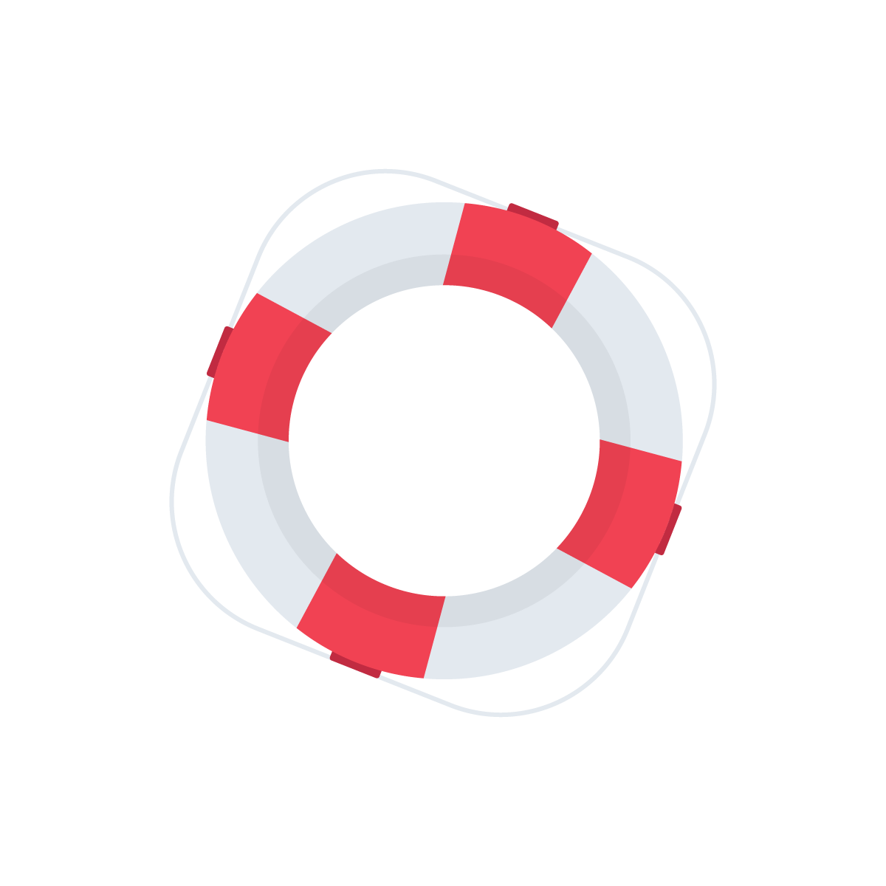
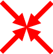

# Unity Sail Boat

Simulate a basic sailboat with 2 sails floating on water around various obstacles, with a view from above on a 2D scene.

## Table of Contents
- [Description](#description)
- [Features](#features)
- [Installation](#installation)
- [Usage](#usage)
- [Contributing](#contributing)
- [License](#license)

## Description
There are 2 sails, a keel and a rudder. The water show via waves the direction and power of the wind.
Controls allow to change the tension by which sails are pulled, and the rudder position.
Physics simulation uses Unity to handle how wind force over the sails is induced over the boat
and affects its movement speed and direction.

Obstacles incluse fixed buoys, and rock wave breakers.

The boat can also throw a small life saver to demonstrate an excercise of pulling a "man in water" situation.

Buttons on the left allow to restrict sail tension control to operate only on one of the sails for doing
various types of maneuvers.

## Features
1. 2 sails, individually controlled, 
1. keel with 3 positions, 
1. rudder with 8 positions each side. 
1. The boat has a life saver buoy to 
create "man in water" alerts and maneuvers. 
1. Wind power on sails computes both blowing wind and air flow affect over the sails as wings at
tight angles. 
1. Sails shape reflects the wind blow force applied to them.
1. When wind blows on loose sails, they flicker from side to side to show that. 
1. When wind changes sides from the back, sails perform a full side change (revolution) that should be done
with care. 
1. Rudder is also affecting the boat drag according to its position, so if set to 90 degrees, it will not cause turn, but slow the boat.
1. Colors of sails reflects direction of wind blow side (green when positive, red when negative). 
1. Rudder color reflects boat speed forward or backward. When boat velocity is negative, the rudder affects the boat turning in a reverse manner.

## Installation
1. Get the project from GIT and use the Unity Editor to run the game.
2. Windows 64-bits: Unzip the installaiton file and run the **Sailing.exe** executable for a full screen experience.
3. Future: APK file for the Android devices.

## Usage
The game has GUI controls as well as short-hand keyboard keys to manage the different boat parts when sailing as in the following table:

| Part | GUI | Keyboard (for the PC version) |
| -------- | -------- | -------- |
|Rudder | Move horizontal slider left and right | Use **left arrow** and **right arrow** keys.|
|Sail Tension| Move left slider up or down| Use **up arrow** and **down arrow** keys.|
|Keel position: up, middle or full| Move the 3 position vertical slider on right| Use the **PgUp** and **PgDown** keys.|
|Sail selection| Two button on bottom left screen allow to select front sail (FS) or main sail (MS) to be affected by the sail tension slider and keys. If both are **not** selected, slider and keys control both sails together. | Use the **W** key for front sail, and **S** key for main sail.|
|Kick rudder| A blue left and right arrows, perform a sudden kick of the rudder to the left or the right respectfully, when clicked. This can help getting the boat out of stalling when facing wind for instance.| Use the **Left shift** and **Right Shift** keys respectfully.|
|Man in the water drill|Click the little buoy  icon to "throw" a small life saver to mark a man in the water situation. Click on the thrown buoy to grab it back to the boat.|Click the **space** bar to toggle man in the water throw/grab action.|
|Pause/Play the game| Click the  icon to **pause** the game, and then the  icon to **resume** it.| Click the **P** key to toggle pause/play modes.|
|Reset, restart the game|Click the  icon to move the boat and screen back to initial state.| Click the **R** key to reset the game.|
| Help info| Click the  icon, to see a keyoard shortcut commands outline image. To close, click the **Close** button on the bottom, or click the icon again.| Click the **?** (usually ? and slash) key for that. Click again to close or hit the **close** button.
| Zoom in/out | No GUI | Use the **Z** key to toggle between zoom out and in of the scene.|
| Track option| No GUI | Use the **X** key to toggle between whether camera follows the boat direction, or stays fixed to the north (screen upwards).|
| Enlarge/Reduce text and icons overlays.| Clicking the green arrows in the  button increases size of all GUI elements, clicking the red arrows in the  button decreases them. | Use the **+** keyboard (the + and = key, without using shift!) for size increase, and the **-** (minus and underline key) to decrease.|
|Quit the program| Click the  icon, then confirm or cancel | **\<CTRL>-C** - hold the control key and click **C**. This too will invoke a confirm dialog.|
|Toggle full screen| No GUI | **F11** - click the function key F11.|

## Tracking info
Display on top left showing the vlaues of four parameters dnamically:
1. ANG D. is the Angular Drag which slows boat turning.
2. LIN D. is the linear Drag which slows the boat velocity on all directions.
3. FWD F. is the wind force that is applied on the boat forward direction.
4. LAT F. is the wind force that is applied on the lateral direction.

## Contributing
The project is presently private so contributions are limited.

## License
This project is licensed under the [Uri](mailto:uri.shani@gmail.com) and [Ofek](mailto:ofeka.shani@gmail.com) Copyrights. Refer to the LICENS.TXT file for more information.