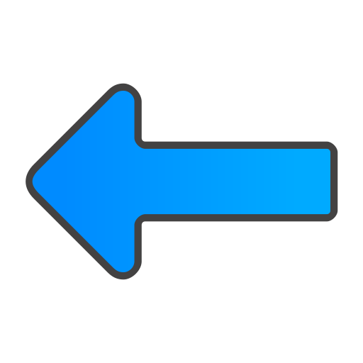
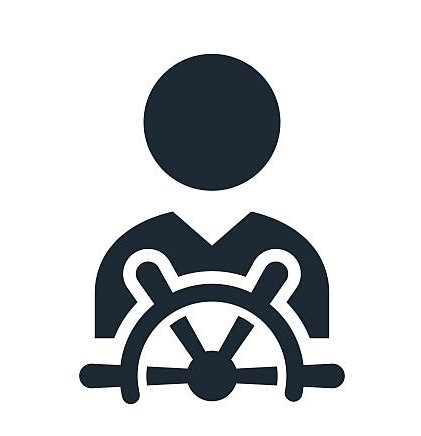
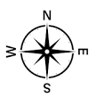
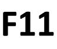
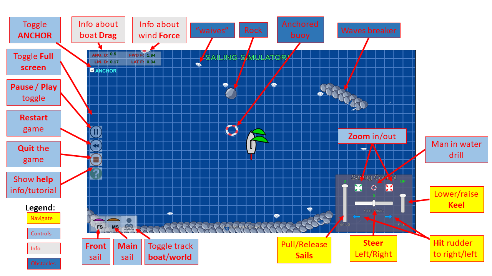

# Sail Boat Simulation Game

Simulate a basic sailboat with 2 sails floating on water around various obstacles, with a view from above on a 2D scene.

## Table of Contents
- [Description](#description)
- [Features](#features)
- [Installation](#installation)
- [Usage](#usage)
- [Keyboard shortcuts](#keyboard-shortcuts)
- [GUI widgets summary](#gui-widgets)
- [Tutorial](#tutorial)
- [Contributing](#contributing)
- [License](#license)

## Description
There are 2 sails, a keel, and a rudder. The water shows via waves the direction and power of the wind.
Controls allow to change the tension by which sails are pulled, and the rudder position.
Physics simulation uses Unity to handle how wind force over the sails is induced over the boat
and affects its movement speed and direction.

Obstacles include fixed buoys and rock wave breakers.

The boat can also throw a small lifesaver to demonstrate an exercise of pulling a "man in the water" situation.

Buttons on the left allow restricted sail tension control to operate only on one of the sails for doing
various types of maneuvers.

## Features
1. 2 sails, individually controlled, 
2. keel with 3 positions, 
3. rudder with 8 positions on each side. 
4. The boat has a lifesaver buoy to 
create "man in the water" alerts and maneuvers. 
5. Wind power on sails computes both blowing wind and airflow effect over the sails as wings at
tight angles. 
6. Sails' shape reflects the wind blow force applied to them.
7. When wind blows on loose sails, they flicker from side to side to show that. 
8. When the wind changes sides from the back, sails perform a full side change (revolution) that should be done
with care. 
9. Rudder is also affecting the boat drag according to its position, so if set to 90 degrees, it will not cause turn, but slow the boat.
10. The colors of sails reflect the direction of the wind blow side (green when positive, red when negative). 
11. Rudder color reflects the boat's speed forward or backward. When boat velocity is negative, the rudder affects the boat turning in a reverse manner.
12. Extensive help info including an animated tutorial.

## Installation
1. Developer: Get the project from GIT and use the Unity Editor to run the game.
2. User on Windows 64-bits: Unzip the installation file 
from Google Drive here: [Sailing-PC.zip](https://drive.google.com/file/d/1CGKh-De8uR1dFWWqPoK8aFnefDiPmVYi/view?usp=sharing). Then run the **Sailing.exe** executable for a full-screen experience.
   - See this [U-tube Overview](https://youtu.be/oTmf4qWnLm4) (in Hebrew).
3. Future: APK file for the Android devices.

## Usage
The game has GUI controls as well as short-hand keyboard keys to manage the different boat parts when sailing as in the following table:

| Part | GUI | Keyboard (for the PC version) |
| -------- | -------- | -------- |
|Rudder | Move horizontal slider left and right | Use **left arrow** and **right arrow** keys.|
|Sail Tension| Move left slider up or down| Use **up arrow** and **down arrow** keys.|
|Keel position: up, middle or full| Move the 3 position vertical slider on right| Use the **PgUp** and **PgDown** keys.|
|Sail selection| Two buttons  on the bottom left screen allows to select the front sail (FS) or main sail (MS) to be affected by the sail tension slider and keys. If both are **not** selected, the slider and keys control both sails together. | Use the **W** key to select the front sail, and **S** key for the main sail.|
|Kick rudder| A blue left  and right  arrows, perform a sudden **"kick"** of the rudder to the left or the right respectfully, when clicked. This can help get the boat out of stalling when facing wind for instance.| Use the **Left shift** and **Right Shift** keys respectfully.|
| Anchor | clicking the toggle button  will stop applying sail power on the boat so it stops | Click the **A** on the keyboard to toggle this button's effect.|
|Man in the water drill|Click the little buoy  icon to "throw" a small lifesaver to mark a man in the water situation. Click on the thrown buoy to grab it back to the boat.|Click the **space** bar to toggle man in the water throw/grab action.|
|Pause/Play the game| Click the  icon to **pause** the game, and then the  icon to **resume** it.| Click the **P** key to toggle pause/play modes.|
|Reset, and restart the game|Click the  icon to move the boat and screen back to the initial state.| Click the **R** key to reset the game.|
| Help info| Click the  icon, to see several help information options: First is the keyboard shortcut commands layout image (see [KEYBOARD](#keyboard)). Second is a summary of all GUI widgets on the screen (as also detailed in this table) image (see [GUI](#scene)). The third option is a series of tutorial animated lessons (see [TUTORIAL](#tutorial)). To close, click the **Close** button on the bottom, or click the icon again.| Click the **?** (usually ? and slash) key for that. Click again to close or hit the **close** button.
| Track option| Click the Follow-Boat button  to track the boat from onboard, which will then turn into the Follow-World button  which will maintain a fixed view from above. | Use the **X** key to toggle whether the camera follows the boat's direction, or stays fixed to the north (screen upwards).|
| Zoom in/out.| Clicking the small green arrows out icon  button to zoom out and see more of the scene around the boat. Clicking the small red arrows in icon  button to zoom in (and see less of the scene). | Use the **+** keyboard key (i.e., the + and = key, without using shift!) for zoom out, and the **-** (minus and underline key) to zoom in.|
|Quit the program| Click the  icon, then confirm or cancel | **\<CTRL>-C** - hold the control key and click **C**. This too will invoke a confirm dialog.|
|Toggle full screen on and off| Click the  button on the screen to toggle full sceen option. | **F11** - click the function key F11.|
|Toggle GUI on and off| No GUI | Click **K** on the keyboard to turn graphics GUI off, leaving the scene details only. Click again to turn them on.|

## Tracking info
Display on the top left showing the values of four parameters dynamically:
1. ANG D. is the Angular Drag that slows boat turning.
2. LIN D. is the linear Drag that slows the boat's velocity in all directions.
3. FWD F. is the wind force that is applied in the boat's forward direction.
4. LAT F. is the wind force that is applied in the lateral direction.

Like this on top left: 

## Keyboard Shortcuts
As part of the game help information is the keyboard layout: 

## GUI widgets
A second part of the game help information - a summary of all the GUI controls on the screen: 

## Tutorial
The third part of the game help information is a series of lessons with animated demonstrations and hands-on steps. For instance, this is the lesson explaining how to work with the sails, the opening explanation, and pointers to the relevant graphics on the screen:

## Versions and changes
The current version 1.1 includes some changes in the GUI and keyboard:
- The GUI size is kept relative to the resolution of the game screen and cannot be changed manually.
- The zoom-in and zoom-out now has many levels that are applied with the keys used previously to change GUI widgets' size: the **+** and **-** keys, and also by the small buttons in the "Sailiung Control" box.
- The "Zoom" button **Z** is not active anymore and the respective GUI button on the left side has been removed.
- It is possible to remove the GUI altogether (via the toggle key **K** on the keyboard) and use only keyboard shortcuts.
## Contributing
The project is presently private so contributions are limited.

## License
This project is licensed under the [Uri](mailto:uri.shani@gmail.com) and [Ofek](mailto:ofeka.shani@gmail.com) Copyrights. Refer to the [LICENSE](LICENSE.txt) file for more information.
